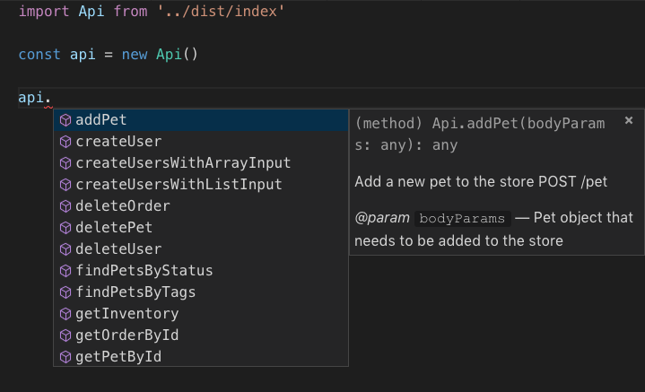
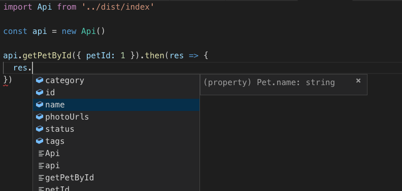

# sisyphus-cli(西西弗斯)

一个从swagger自动生成ts代码的工具

## 为什么要使用这个？

1. 减少模板代码
2. 接口的版本控制 
3. 请求参数和返回结果的自动提示 
4. 自动生成文档和注释

接口文档和参数



请求参数和注释


返回参数和注释



# 如何使用

## 安装cli

`npm install sisyhpus-cli -g`

## 如何增加新的项目

1. 新建文件夹如`xxx-api`
2. `sisyhpus init xxx-api`初始化
3. 查看如何更新代码

## 如何更新代码

1. 进入相应文件夹如`xxx-api`
2. 查看`sisyhpus.json`文件file路径是否执行对应swagger的地址
3. 执行`sisyhpus`更新代码
4. 执行`npm run build`打包
5. 将dist的js和d.ts复制到项目或者使用`npm publish`发布

# 原理

`sisyhpus-cli`会根据swagger.json生成类似代码

```javascript
class Api {
  constructor(request){
    this.request = request
  }

  function getDetail(pathParams, queryParams, bodyParams){
    return this.request({
      url: bindUrl('/detail', pathParams),
      method: 'GET',
      params: queryParams,
      data: bodyParams
    })
  }
}
```

# 如何引入

```javascript
import Api from 'xxx-api';
```

## 编写适配器 

由于生成的代码是按照axios的格式组织参数，所以针对不同的请求库，要做一层封装。
以`fetch`为例

```javascript
function adapter(requestInstance) {
  /**
   *
   * @param {AjaxOptions} options
   */
  return options => {
    const baseUrl = '/api';
    let { url } = options;
    const { params, data, ...restParams } = options;
    url = baseUrl + url;
    if (params) {
      url = `${url}?${stringify(params)}`;
    }
    return requestInstance(url, { ...restParams, body: data });
  };
}

const api = new Api(adapter(request));

api.login({ useraname: xxx, password: xxx }).then(res => {})
```

# QA

Q: 我遇到了中文的model怎么办？
> A: 修改java中的注解，`@ApiModel("xxx")` => `@ApiModel(description = "xxx")`

# TODO

* [x] 生成model代码
* [x] 生成api代码
* [x] 优化注释
* [x] 自动打包发布到npm，包含可以提示的d.ts
* [ ] 自动生成浏览器可以用的js
* [ ] 考虑泛型的优化